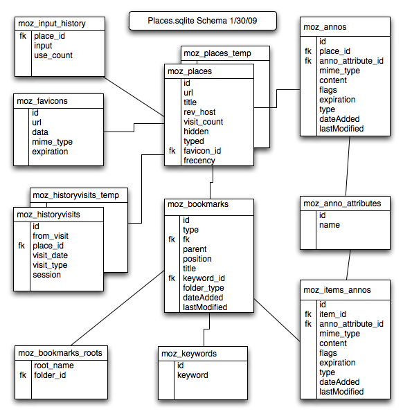
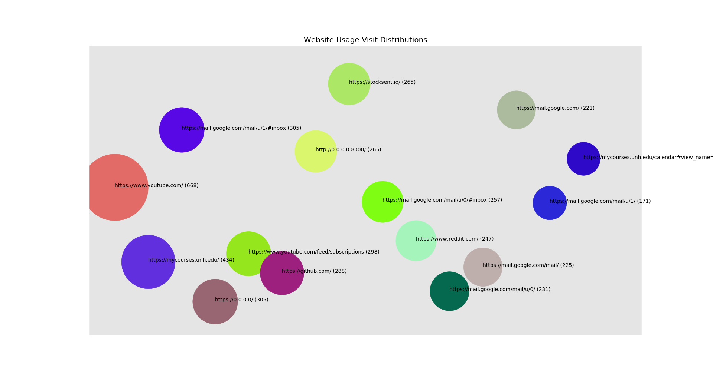
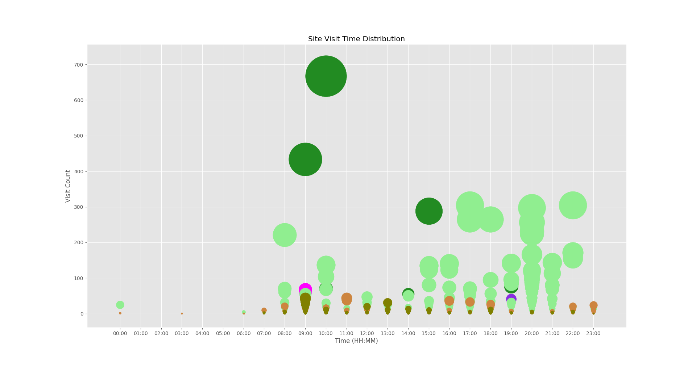

# my-analytics

A simple program for parsing and monitoring firefox usage by analyzing the *places* sqlite database.

"Places is the bookmarks and history management system introduced in Firefox 3. It offers increased flexibility and complex querying to make handling the places the user goes easier and more convenient. It also includes new features including favicon storage and the ability to annotate pages with arbitrary information."

## Usage

To analyze your own firefox data, replace the `places_directory` in the `config.yml` file at the root of the project.

```
pip3 install --user -r requirements.txt
python3 main.py
```

## Schema

Below is the places.sqlite schema from FireFox documentation:



## Output



